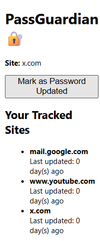

# 🔐 PassGuardian - Chrome Extension

PassGuardian is a lightweight Chrome extension that tells you how many days are left before you should change your password — based on a 90-day cycle. No popups, no distractions — just open it when you want to check.

## 📌 Why This Extension?

Most users forget when they last changed their password. While some tools enforce periodic password updates, they’re often intrusive. PassGuardian takes a subtle approach:  
**It shows you how many days are left until your next password change — only when you choose to open it.**

## ✨ Features

- 📅 Starts a 90-day countdown the day it's installed
- 🔁 Every time you open the extension, it shows:
  - How many days are left  
  - Or reminds you to update your password if 90 days have passed
- 🔒 No login, no server, fully offline
- 🚫 No popups or notifications — check it only when you want

## 🧑‍💻 How It Works

1. On first use, the extension stores the current date.
2. Each time you open the extension popup:
   - It calculates the number of days passed.
   - It shows how many days are left or notifies you that it’s time to change your password.
3. Everything is stored locally using `chrome.storage.local`.

## 📸 Screenshots

## 📁 Project Structure
PassGuardian/
├── manifest.json
├── popup.html
├── popup.js
├── profile.png
├── style.css

## 🚀 Installation

1. Download or clone this repository.
2. Go to `chrome://extensions/` in Chrome.
3. Enable **Developer mode** (top right).
4. Click **Load unpacked** and select the `PassGuardian/` folder.
5. Pin the extension for easy access.

## 🛠️ Tech Used

- JavaScript
- HTML/CSS
- Chrome Extensions API

## 💡 Future Improvements

- Add reset button for manual cycle restarts
- Optional dark mode
- Support multiple password timers (e.g. work email, social media)

## 👨‍🎓 Built By

**G Santosh Kumar**
If you found this useful, feel free to ⭐ star this repo!

---

## 📬 License

This project is licensed under the MIT License.

